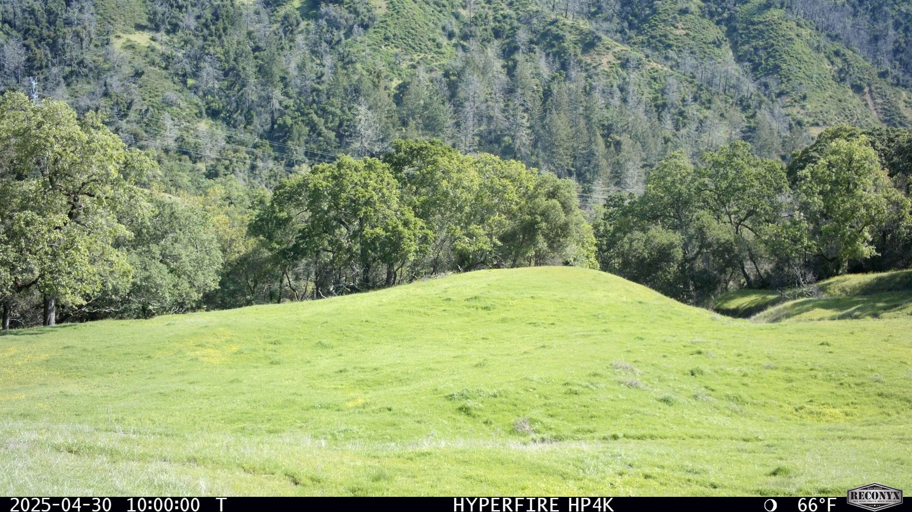
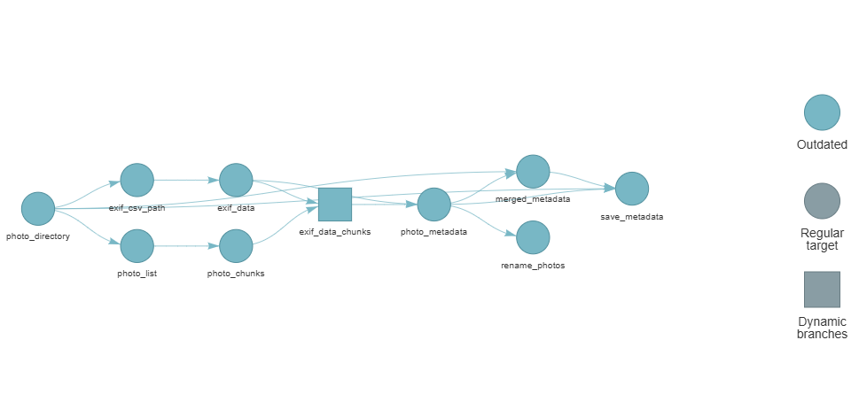
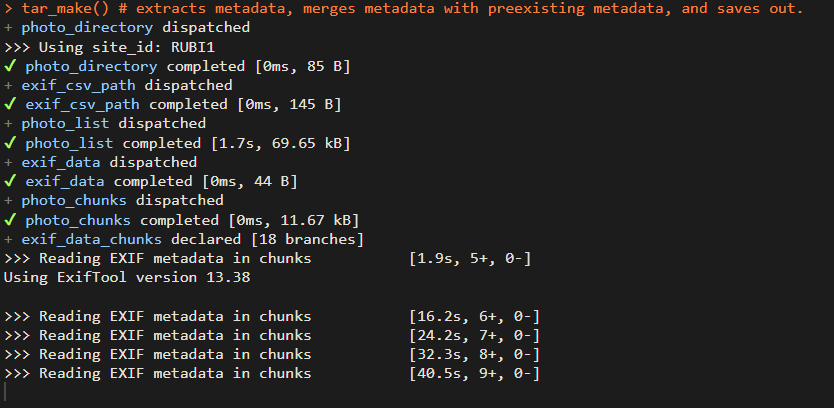
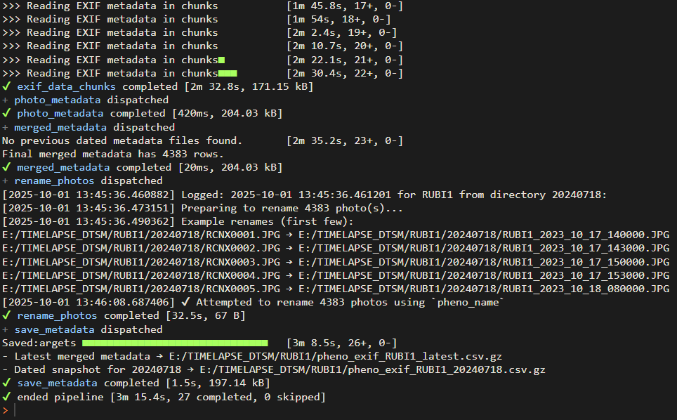
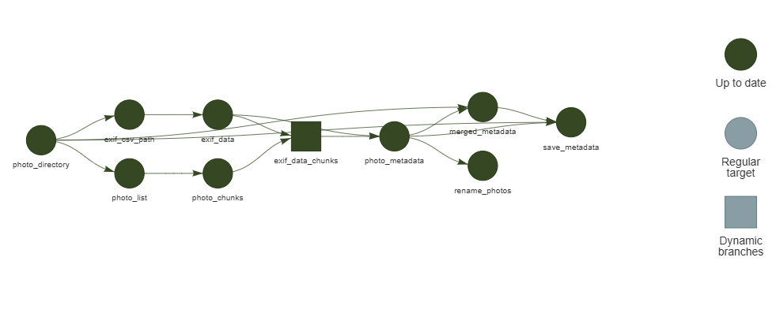
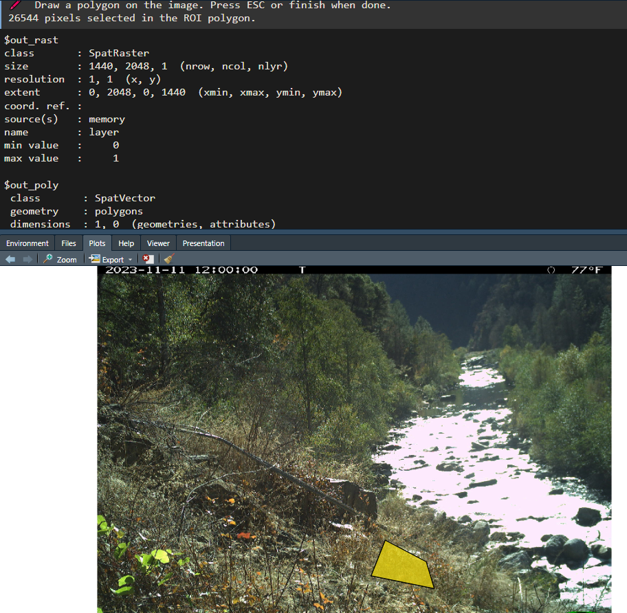

# Processing Timelapse Imagery


- [Installing `exiftools`](#installing-exiftools)
- [Setting Up RProject](#setting-up-rproject)
- [Image Processing Pipeline](#image-processing-pipeline)
  - [Package Install](#package-install)
  - [Setting the Photo Directory](#sec-photodir)
  - [Adjusting User Parameters](#adjusting-user-parameters)
  - [Visualize & Run Pipeline](#visualize--run-pipeline)
  - [Success!](#success)
- [Creating a Region of Interest
  (**ROI**)](#creating-a-region-of-interest-roi)
  - [Extracting Metrics](#extracting-metrics)



In order to create timelapse videos, extract information from pixels in
specific vegetation regions, and generally do all the fun analysis bits,
there are a few hoops we need to jump through before we can end up with
the figures and data. This walks you through setting things up.

## Installing `exiftools`

The first hurdle is installing a bit of software called `exiftools`,
which is something that allows us to extract metadata from our photos
like the timestamps and dates, exposure, and ultimately the pixel values
from each <span style="color:red">Red</span>
<span style="color:blue">Blue</span>
<span style="color:green">Green</span> (RGB) pixel. It’s open source,
and should not require administrative permissions. We only need to do
this once per R installation! So if you update your R version, you may
need to run through steps 6 and 7 again.

> [!TIP]
>
> ### Download to same Location
>
> One easy approach is to make a **`software`** folder in your local
> `Downloads` directory. All software you download can go there, and
> stay there.

1.  Navigate to the website: <https://exiftool.org/>
2.  look for Windows Executable (stand-alone) version:
    exiftool-xx.xx.zip
3.  Download to a place you can find (i.e.,
    `Downloads/software/exiftool-13.38.zip`)
4.  Open RStudio and find the `Console` Panel
5.  Create path to the downloaded tool, *make sure the version number
    matches what you have!* On Windows machines, we can use **Shift +
    Right Click \> Copy as Path**
6.  Check your path is valid!

``` r
# paste your path inside the parenthesis below WITHOUT QUOTATION MARKS
path_to_exif_zip <- r'(C:\Users\USERNAME\Downloads\software\exiftool-13.38_64.zip)'

## check path is valid!
if(fs::file_exists(path_to_exif_zip)=="TRUE") {
  print("Path is legit!")
} else( "Path is borked...double check")
```

6.  Install R package `{exiftoolr}`

``` r
## Install package:
install.packages("exiftoolr")
library(exiftoolr) # should load
```

7.  Install & link the downloaded `exiftool` software in R

``` r
## this only needs to be done once per R installation
install_exiftool(local_exiftool = path_to_exif_zip)

## Check EXIF works:
exif_version()
# should return "Using ExifTool version XX.XX" and the version you installed
```

## Setting Up RProject

Great! That may be one of the hardest steps. Next up we need to start by
downloading the code base and R project we’ll need to run everything.
The most current version lives in a repository here:

- [timelapse_targets](https://github.com/ryanpeek/timelapse_targets/tree/main)

1.  Navigate to the link above, and click on the green “**\< \> Code**”
    button. At the bottom, click on “**Download ZIP**”. Save to a known
    location.


2.  Navigate to where you downloaded the zip file, and unzip/extract to
    a new folder. You can specify where you want this project to live,
    recommend using a location you keep other R/code projects.
3.  Open the new `timelapse_targets-main` folder, and double click the
    `timelapse_targets.Rproj` file to open our RStudio project.

# Image Processing Pipeline

Now we can begin processing our imagery! Before proceeding, make sure
you have the raw imagery downloaded locally, or you have an external
drive connected to your computer with the imagery.

## Package Install

Nearly there! This is the last big hurdle.

1.  We need to open the `run_pipline.R`script in our open RStudio
    project.
2.  Starting at the **`A: AUTOMATED PIPELINE`** step, run the code
    below:

``` r
# note, this may take a minute or two the first time
source("R/packages.R")
```

> [!NOTE]
>
> The first time we run this, it is checking whether packages have been
> installed, and if not, it will install each package that is missing.
> Then it loads each package required. This can take a few minutes the
> first time through.

## Setting the Photo Directory

Now we select a photo from the directory our photos live.

> [!IMPORTANT]
>
> The folder structure matters here. We assume our photo directory is
> setup as follows, where each deployment or camera check corresponds to
> a folder named with the date of the last photo in that set.
>
>
>     TIMELAPSE  
>         --> SITE_ID  
>             --> YYYYMMDD
>             --> YYYYMMDD (...)

When running the code below, a window will pop up. Sometimes you need to
minimize RStudio to see it. Use that popup window to navigate to the
folder of interest and select ANY image inside the folder, then click
OK.

``` r
source("set_photo_dir.R")
```

We should see some text returned in the Console that matches the folder
we selected, as well as the SITEID, which will be the folder name that
the YYYYMMDD photo folder lives beneath. Double check this matches
expectations, and rerun/reselect again if not.

## Adjusting User Parameters

The next step is much more dependent on the user. Here we want to open
the `user_parameters.R` file (use the Files panel and click on the file
to open). We can set a few different parameters here, and this file can
be modified/rerun throughout the pipeline as needed.

- `make_timelapse_video <- FALSE`
  - Change to TRUE if you want to create a timelapse video. Can update
    the dates and rerun to generate new videos for specific time frames.
- `date_start <- as.Date("2025-04-30")`
- `date_end <- as.Date("2025-09-14")`
  - Start and end dates are used to filter processing of imagery, name
    files, and create timelapse videos. Adjust based on the imagery in
    your folder, or to make more extensive timelapse videos you can
    expand to include other photo sets from the same site.
- `mask_type <- "GR_01_01"`
  - This is to define the type of region of interest (ROI) we will
    create/select. The first number represents the photo set (YYYYMMDD),
    the second number represents how many replicates within that photo
    set for that same vegetation mask type. So multiple GRASS regions
    may be defined in the same photo set, and would be GR_01_01,
    GR_01_02, etc.

After making changes, be sure to save the `user_parameters.R` file, and
source the file to load everything in the Environment.

``` r
source("user_parameters.R")
```

## Visualize & Run Pipeline

Now we get to the good part. We are using the
[{targets}](https://docs.ropensci.org/targets/) framework, which is an
amazing pipeline tool that helps identify and run workflow steps in a
reproducible way, and can pickup wherever things leave off/break/need
updating.

#### Visualize Pipeline

To get started, the first thing to do is to visualize our pipeline:

``` r
tar_visnetwork(targets_only = TRUE)
```

The first time through, we would expect everything to be blue or
“Outdated”. Each dot or square is a step or function that is run, and
steps are linked or rely on the upstream targets.



#### Run Pipeline

Next we run the pipeline. This will provide a bunch of text in the
console, and will chunk through each step. For folders with thousands of
photos, this may take a few minutes. The steps will complete
successfully with a green checkmark before proceeding.

``` r
tar_make()
```



As the processing continues, the photo metadata is extracted, the photos
are renamed, and metadata is merged with existing data if present.



If rerun the visualization code again
(`tar_visnetwork(targets_only = TRUE)`), we expect to see all steps are
now green, and <span style="color:forestgreen">**Up to date**</span>.



## Success!

Double check the folder where your photos live, we should now have
renamed all photos (as `SITEID_YYY_MM_DD_HHMMSS.JPG`), in the main
SITEID folder, we should have a `pheno_exif_SITEID_YYYYMMDD.csv.gz`
corresponding to the folder we just processed, as well as a
`pheno_exif_latest.csv.gz`, which is the combined metadata for all
photos if there are multiple deployment dates.

# Creating a Region of Interest (**ROI**)

Now we can specify our region of interest to extract pixels. This can be
done immediately after, or can be done at another time. The only
important part is to verify the `user_parameters.R` for the correct ROI
mask, and that we are indeed using the correct site. If the site/path to
photos is incorrect, we can re-run the setting the photo directory code
(`source("set_photo_dir.R")`) to pick the correct site and photo set.

Next we load our data and functions. We can make a quick plot to show
the timespan and image size, which helps identify if the photos have a
mix of different sizes or reference frames. Ideally we expect a single
horizontal orange line.

``` r
source("user_parameters.R")
source("R/packages.R")
source("R/create_polygon_roi.R")

# site_id and photo directory loaded from user_parameters
photo_exif <- load_photo_metadata(user_directory, site_id)

# see what the time span looks like and if image has shifted
# expect line to be horizontal an largely unbroken
ggplot(data=photo_exif, aes(x=datetime, y=image_height)) +
  geom_line(color="gray") +
  geom_point(pch=16, color=alpha("orange",0.7), size=4) +
  labs(x="", y="Image Height (px)") +
  scale_x_datetime(date_breaks = "2 month", date_labels = "%b-%y") +
  theme_light()
```

#### Filter to Time/Date Range

Next we want to filter our photos to just the time and date range
specified in our `user_parameters.R` file. Generally only photos from
12:00pm each day are sufficient. We can see how many total photos and
how many filtered photos this gives us. We also double check our ROI
label is correctly specified.

``` r
# Filter photos to the time and date range specified in user_parameters.R
# this helps reduce processing. You can always extract for
# every photo if you want by using the full "photo_exif"
photo_exif_filt <- photo_exif |>
  filter(
    hms::as_hms(datetime) >= hms::as_hms(time_start) & hms::as_hms(datetime) <= hms::as_hms(time_end)) |>
 filter(as_date(datetime)>=date_start & as_date(datetime)<= date_end)

# note how many in full dataset vs. filt dataset:
nrow(photo_exif)
nrow(photo_exif_filt)

# specify mask type if using something different than in user_parameters
mask_type
```

> [!NOTE]
>
> If anything looks off, or we want to change, we can always open the
> `user_parameters.R` file, make edits to the ROI or time/date ranges,
> reload or `source('user_parameters.R')`, and re-run the code above to
> verify things.

#### Draw a Region of Interest

Now we run the function that will allow us to draw a region of interest
(ROI) to extract pixel data from. Run the function below, and be sure to
click carefully to draw your polygon. Each click creates a point of the
polygon, and when done, hit **`ESCAPE`** to save. When hitting
**`ESCAPE`**, the polygon will automatically complete, so it is not
necessary to fully close the loop. If the photo isn’t ideal, you can
change the `index=` to select a different date to draw the ROI on.

``` r
make_polygon_roi(photo_exif_filt, index = 25, 
  mask_type = mask_type, user_directory, overwrite = TRUE)
```

> [!CAUTION]
>
> **Important:** RStudio has a small glitch that can appear to cause an
> orthogonal shift in where you are drawing the polygon. If this
> happens, try one of the following:
>
> - In RStudio Menu, go to View \> Actual Size, then redraw polygon.
> - On Windows: use a X11 window. Run `x11()` in your console, then
>   re-run function and redraw polygon in the X11 window.
> - On macosx: use a quartz window. Run `quartz()` then re-run function
>   and draw polygon.

When complete, the resulting information printed in the console should
show the number of pixels in the polygon, a yellow completed polygon in
the image, and if you check the `SITEID` directory you should find a
directory called `ROI` which contains a `.png` of the ROI, and the
actual `.tif` mask that will be used for extraction and analysis.



## Extracting Metrics

Finally we can use these ROI’s to extract various metrics based on the
RGB pixel values. As above, we load our parameters and functions, and
filter to the timeframe of interest. We can change these values quickly
by editing the `user_parameters.R` file.

``` r
# can start pipeline here too:
source("R/packages.R")

# make sure to check parameters in user_parameters
source("user_parameters.R")
source("R/f_load_photo_metadata.R")
source("R/run_rgb_parallel.R")

# site_id and photo directory loaded "latest.csv.gz"
photo_exif <- load_photo_metadata(user_directory, site_id)

# Filter photos to the time and date range specified in user_parameters.R
photo_exif_filt <- photo_exif |>
  filter(
    hms::as_hms(datetime) >= hms::as_hms(time_start) & hms::as_hms(datetime) <= hms::as_hms(time_end)) |>
  filter(as_date(datetime)>=date_start & as_date(datetime)<= date_end)

# note how many photos in full dataset vs. filt dataset:
nrow(photo_exif)
nrow(photo_exif_filt)
```
